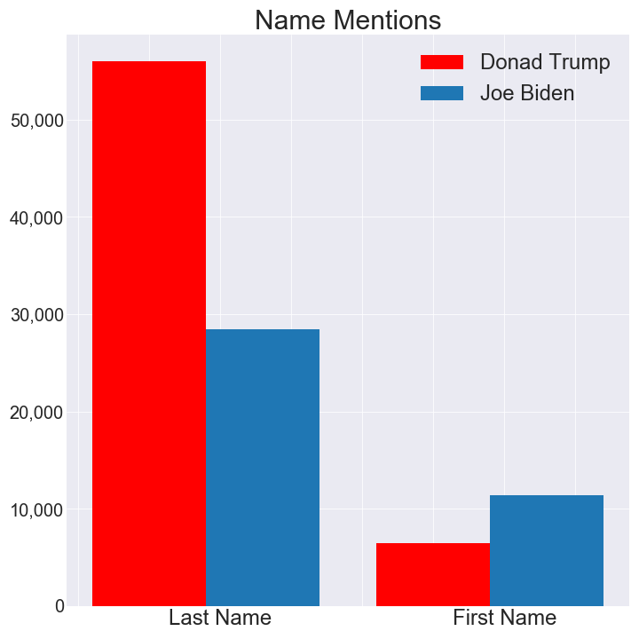
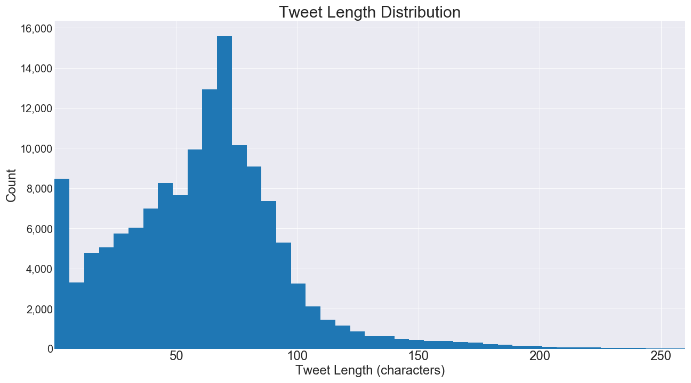
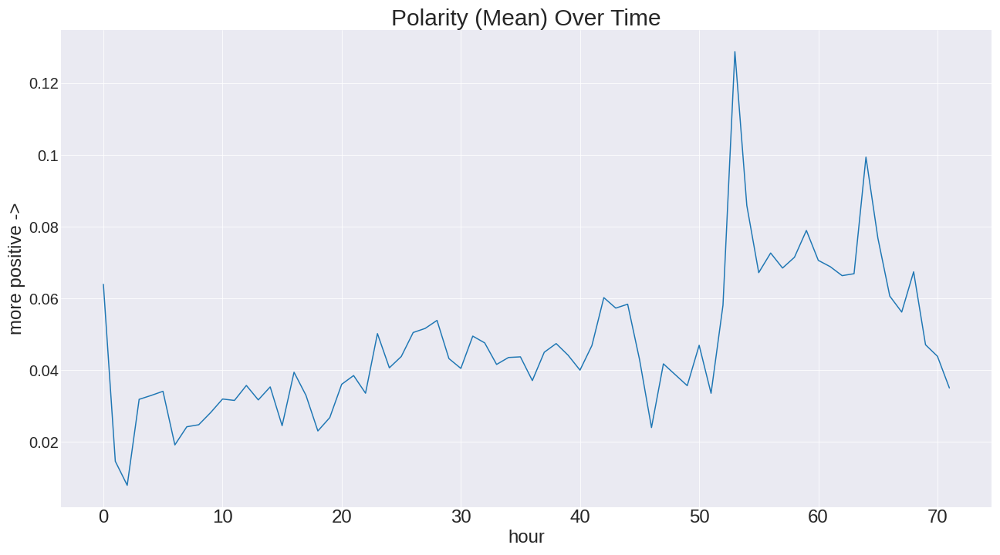
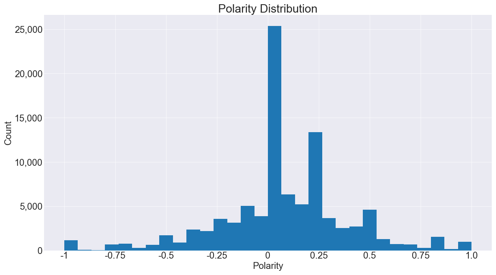
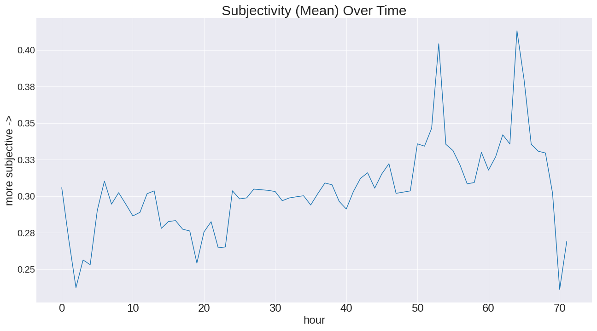
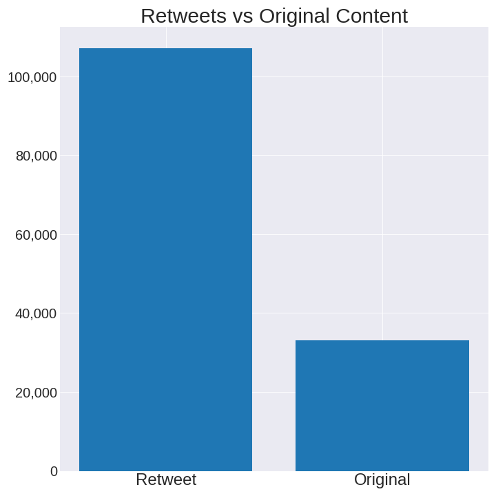
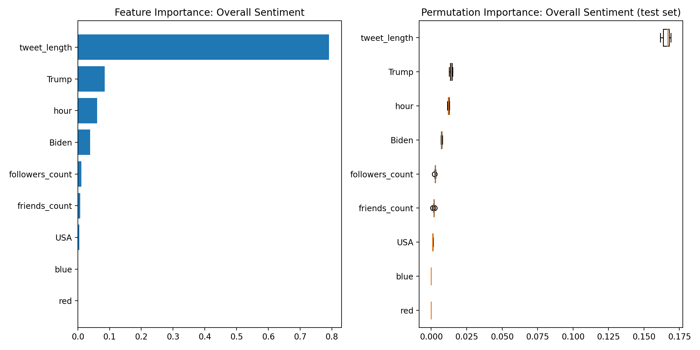

# Election_Tweets

## Project Goal and Process

The goal of this project was to predict sentiment as measured by polarity and subjectivity of 2020 election related tweets. Sentiment polarity determines whether the tweet is positive, negative, or neutral on a scale of -1 (most negative) to 1 (most positive). Subjectivity measures how much opinion is inserted into the tweet. It is generally believed that high opinion tweets (high subjectivity is closer to 1 and low subjectivity is closer to 0). We can then combine the absolute value of polarity and the value of subjectivity to get an overall sentiment score for the tweet.

Feature engineering included extracting location from the tweet if possible (including which state), determining if possible whether the tweet was from an American (if there was a state listed or other "American" related word in the locations), determining whether Trump and/or Biden were discussed in the tweet, determine whether it was a retweet, determining which hour the tweet was created (between 0 and 71), and measuring polarity, subjectivity, and overall sentiment of the tweet by combining subjectivity and polarity. Polarity and subjectivity were measured using the Python TextBlob library.

Because these tweets were made after the first Presidential debate, it will be especially interesting to determine how sentiment changes as the hours pass. Do people become more or less subjective or polarizing?

## Obtaining Data
Tweet Data Source: [GitHub Repo link provided @12PM Friday 10/29/2020]
1. Clone [GitHub Repo link provided @12PM Friday 10/29/2020]
2. Follow the instructions in the repository to install twarc and tqdm.
3. Apply for a twitter developer account.
4. Save api key, save api secret key, save bearer token.
5. Enter your twitter api information into twarc.
6. Use a mv command to move the contents of the desired days into a new single directory.
7. Look inside the cloned repository for the appropriate .txt files containing tweet ids. (ex. cat * >> file name.txt)
8. Concatenate those files into one file.
9. In the terminal, use awk 'NR % 100 == 0' <file.txt> > <result.txt> to systematically sample every 100th tweet id. These are the tweets you will hydrate.
10. Modify the hydrate.py script in the cloned repository and run the script to rehydrate tweets from your file of tweet ids.
11. Analyze tweets.

Red/Blue State Labels: https://en.wikipedia.org/wiki/Red_states_and_blue_states#Table_of_presidential_elections_by_states_since_1972

## Exploratory Data Analysis

We can see that Donald Trump is mentioned much more than Joe Biden. Interestingly, those who do mention Joe Biden more often call him "Joe" while those who mention Donald Trump most often call him "Trump".

The maximum tweet length is 280 characters, although by viewing this distribution plot, we can see that most tweets are much shorter.

Polarity has an upward trend as the hours go by after the debate. We initially hypothesized that the polarity would be higher immediately after but it seems that this is not the case.

There are many instances where the TextBlob library indicates that the polarity is 0 (neutral) because it cannot determine otherwise. Amongst non zero values, there are more positive tweets than negative tweets.

Like polarity, subjectivity has an upward trend as the hours go by after the debate, although it sharply drops around hour 70.

Subjectivity also has several 0 values and amongst non zero values, more treats are classified as subjective than objective.

There are more retweets than original content in our dataset.

## Baseline Models

Using a Gradient Boosted Regressor with the following parameters:
params = {'n_estimators': 500,
          'max_depth': 4,
          'min_samples_split': 5,
          'learning_rate': 0.01,
          'loss': 'ls'}
and the following features: USA(1=yes, 0=no or unsure), Tweet Length, Hour, Biden Mentions(1=yes, 0=no), Trump Mentions(1=yes, 0=no), and Retweet(1=yes, 0=no),
the mean squared error for predicting polarity was 0.06 and the mean average error was 0.16.

Using the same model, features, and parameters to predict subjectivity, we found that the mean squared error was .089 and the mean absolute error was 0.248.

## Final Model Results

For the final model, we used a Gradient Boosted Regressor with the same parameters and the following features: USA(1=yes, 0=no or unsure), Tweet Length, Hour, Biden Mentions(1=yes, 0=no), Trump Mentions(1=yes, 0=no), and Retweet(1=yes, 0=no), Red state (1=yes, 0=no), Blue state (1=yes, 0=no), Friends Count, Followers Count

Subjectivity mean squared error was 0.0875 (a slight improvement from .089) and mean absolute error was 0.245 (a slight improvement from 0.248).

We also looked at predicting the overall sentiment (subjectivity + polarity). The model had a mean squared error of 0.22 and a mean average error of 0.37.

Mean average error is easy to interpret; it is the mean difference between the model's predictions and the actual result. The mean average error is high at 0.37 compared to the average overall sentiment of 0.46. We hope to improve the model in the future by adding further features, exploring other ways to emasure overall sentiment, and determining if using the tweeter's actual state (as opposed to just a red/blue label) would improve the model.

Feature Importance and Permutation Importance was also something to consider. Permutation feature importance measures the increase in the prediction error of the model after we permuted the feature's values, which breaks the relationship between the feature and the true outcome (Source: https://christophm.github.io/interpretable-ml-book/feature-importance.html). 

We can see that length of tweets by far are the most important feature in terms of predicting the overall sentiment. This holds true for both polarity and subjectivity independently.
